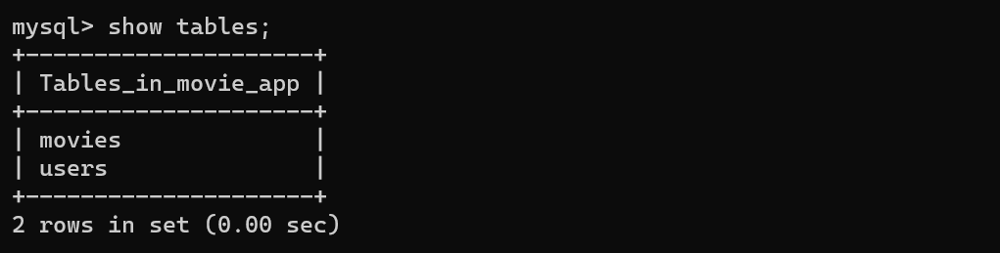
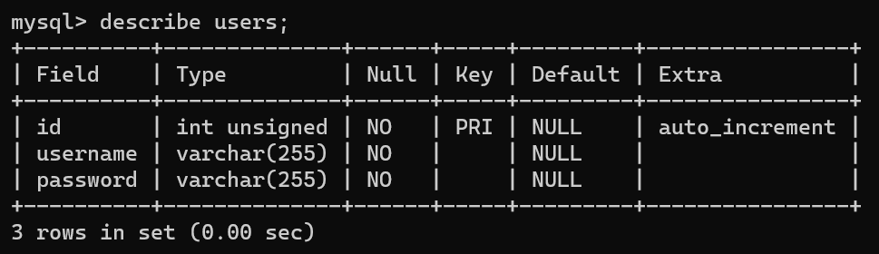
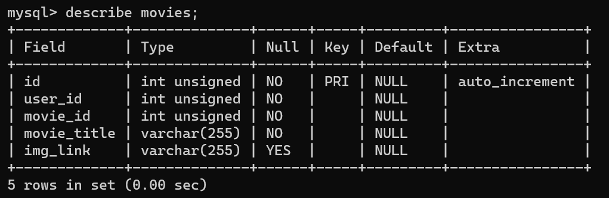

# Netplix-and-Chill

## Daftar Isi
* [Deskripsi Singkat Program](#deskripsi-singkat-program)
* [Struktur Program](#struktur-program)
* [Struktur Database](#struktur-database)
* [Requirement Program](#requirement-program)
* [Setup Environment](#setup-environment)
* [Setup .env File](#setup-env-file)
* [Run Program](#run-program)
* [Screenshots](#screenshots-program)
* [Authors dan Pembagian Kerja](#authors-dan-pembagian-kerja)

## Deskripsi Singkat Program
NETPLIX menampilkan film terbaru dan terlaris.
Anda dapat menambahkan film yang ingin ditonton ke dalam watchlist Anda.
Aplikasi web ini dibuat dengan menggunakan EJS, Node.js, serta MySQL.

## Struktur Program
```bash
.
│   .gitignore
│   app.js
│   database.sql
│   example_dotenv.txt
│   package-lock.json
│   package.json
│   README.md
│              
├───public
│   ├───css
│   │       style.css
│   │       
│   └───images
│           icon.png
│           imageError.png
│           topBesar.png
│           topKecil.png
│           
└───views
        detail.ejs
        error.ejs
        explore.ejs
        login.ejs
        register.ejs
        search.ejs
        top.ejs
        view.ejs
        watchlist.ejs
```

## Struktur Database
* Database

* Tabel users

* Tabel movies

* ERD

* Penjelasan
Tabel users: Mencatat users yang terdaftar pada database. Digunakan saat register dan login.
Tabel movies: Mencatat movies yang ditambahkan ke watchlist oleh user. Digunakan saat add movie, remove movie, dan view watchlist.

## Requirement Program
1. Node.js versi terbaru (Anda dapat menginstall Node.js dari link berikut [ini](https://nodejs.org/en/)).
2. MySQL versi terbaru (Anda dapat menginstall MySQL dari link berikut [ini](https://dev.mysql.com/downloads/windows/installer/)).

## Setup Environment
1. Jalankan perintah `npm install` pada command prompt untuk melakukan instalasi semua middleware yang digunakan oleh program.
2. Buatlah sebuah database baru dengan nama `movie_app` pada MySQL.
3. Jalankan perintah `mysql -u root -p movie_app < database.sql` pada command prompt untuk melakukan pendefinisian tabel.

## Setup `.env` File
* PORT={Port yang digunakan}
* HOST={Hostname / IP yang digunakan oleh MySQL}
* USER={Username dari MySQL}
* PASSWORD={Password dari MySQL}
* DATABASE={Nama dari database yang digunakan}
* API_KEY={Didapatkan dari API service [TMDb](https://www.themoviedb.org/) (Tutorial mendapatkan API TMDb: [Registrasi & Testing TheMovieDb API](https://www.dicoding.com/blog/registrasi-testing-themoviedb-api/))}
* SECRET_KEY={Random string untuk middleware session}
* JWT_TOKEN={Random string untuk middleware jwt}
* SALTROUND={Cost Factor untuk middleware bcrypt}

## Run Program
1. Jalankan perintah `npm run start` untuk menjalankan aplikasi web.
2. Jalankan localhost dengan port yang digunakan pada file `.env` pada web browser.

## Screenshots Program

## Authors dan Pembagian Kerja
1. [Rayhan Kinan Muhannad](https://github.com/rayhankinan) (GDSC ID: 189)
* Membuat Backend REST API menggunakan NodeJS
* Merancang Database menggunakan MySQL
* Menghubungkan Backend REST API dengan Database MySQL
* Membuat Frontend menggunakan EJS dan CSS